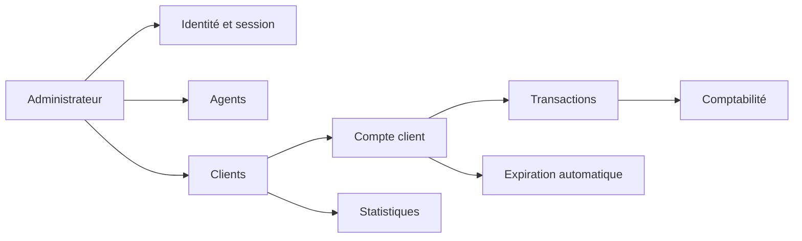
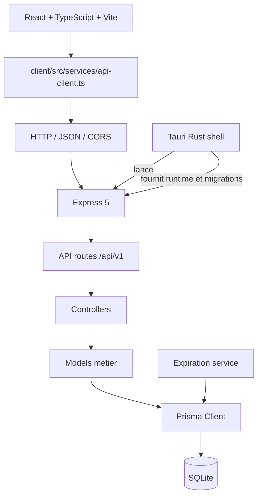
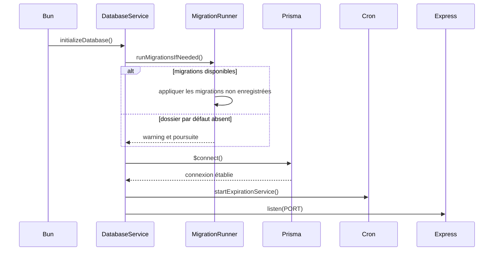
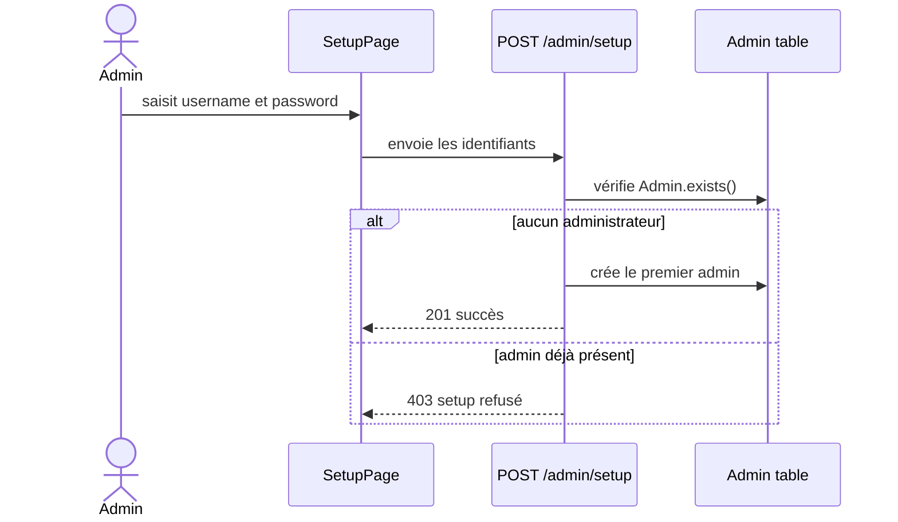
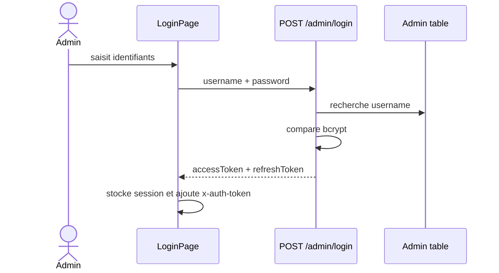
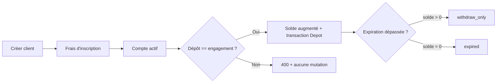
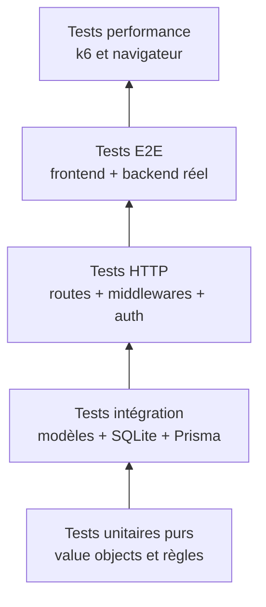
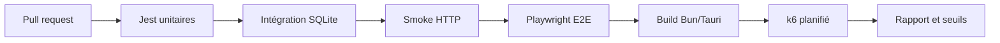

# Micro Banking Core
## Architecture métier, invariants et stratégie de test

> Document de référence pour comprendre l'application, protéger ses règles métier et préparer une campagne de tests fonctionnels, d'intégration, E2E et de performance.
>
> **État observé dans le dépôt :** les tests Jest de contrôleurs existent déjà côté serveur. Aucun scénario k6, Playwright ou test HTTP d'intégration dédié n'a été identifié dans le dépôt au moment de la rédaction.

---

## Sommaire

1. [Vue d'ensemble](#1-vue-densemble)
2. [Architecture technique](#2-architecture-technique)
3. [Bounded contexts](#3-bounded-contexts)
4. [Invariants métier](#4-invariants-métier)
5. [Value objects et contrats](#5-value-objects-et-contrats)
6. [Parcours utilisateurs](#6-parcours-utilisateurs)
7. [Tests déjà présents](#7-tests-déjà-présents)
8. [Stratégie de test cible](#8-stratégie-de-test-cible)
9. [Implémentations de tests prêtes à intégrer](#9-implémentations-de-tests-prêtes-à-intégrer)
10. [Performance avec k6](#10-performance-avec-k6)
11. [Métriques et seuils](#11-métriques-et-seuils)
12. [Matrice des risques](#12-matrice-des-risques)
13. [Plan de livraison](#13-plan-de-livraison)
14. [Prompt PowerPoint](#14-prompt-powerpoint)

---

## 1. Vue d'ensemble

Micro Banking Core est une application bancaire locale, destinée à une petite structure opérant avec un administrateur, des agents et des clients.

Elle couvre notamment :

- la création et l'authentification de l'administrateur ;
- la gestion des agents ;
- la gestion des clients et leur rattachement à un agent ;
- la gestion de comptes clients avec montant d'engagement fixe ;
- les dépôts, retraits, frais d'inscription et frais de réactivation ;
- l'expiration automatique des comptes ;
- la comptabilité et les statistiques du tableau de bord ;
- un fonctionnement local-first avec SQLite ;
- un packaging desktop Tauri avec un backend Bun en sidecar.

### 1.1 Vue fonctionnelle



### 1.2 Ce que l'application protège

La donnée la plus sensible n'est pas uniquement l'identité de l'utilisateur : ce sont les transitions d'un compte et la cohérence entre son solde, son état et son historique de transactions.

Une stratégie de test utile doit donc vérifier simultanément :

- le code HTTP et le contrat de réponse ;
- la mutation de la base ;
- l'absence de mutation lorsqu'une règle est violée ;
- la transaction d'audit créée par l'opération ;
- les transitions d'état dans le temps.

---

## 2. Architecture technique



### 2.1 Répartition des responsabilités observée

| Couche | Emplacement | Responsabilité | Exemple |
|---|---|---|---|
| Présentation | `client/src/features` | écrans, formulaires, navigation | `SetupPage`, `ClientPage` |
| Accès HTTP | `client/src/services/api-client.ts` | base URL, token, erreurs | Axios et header `x-auth-token` |
| Routes | `server/src/api` | exposition des endpoints | `admin.routes.ts` |
| Contrôleurs | `server/src/controllers` | orchestration HTTP et règles applicatives | `client.controller.ts` |
| Modèles | `server/src/models` | accès Prisma et opérations métier | `Admin.ts`, `Client.ts` |
| Infrastructure | `server/src/services` | Prisma, migrations, cron | `database.ts`, `migrationRunner.ts` |
| Schéma | `server/prisma/schema.prisma` | tables, relations, contraintes de persistance | `Client`, `Transaction` |
| Desktop | `desktop/src/lib.rs` | lancement et supervision du sidecar | backend Bun |

### 2.2 Flux de démarrage



Le runner actuel distingue le chemin par défaut du chemin explicitement fourni par `PRISMA_MIGRATIONS_PATH`. Un dossier par défaut absent est ignoré avec un warning ; un chemin explicite absent remonte une erreur. Le runtime Tauri n'est pas modifié par cette stratégie.

---

## 3. Bounded contexts

Les bounded contexts ci-dessous sont une lecture DDD pragmatique de l'architecture existante. Ils ne supposent pas que chaque contexte possède déjà un module ou un agrégat dédié.

### 3.1 Identity & Administration

**Responsabilité :** créer le premier administrateur, se connecter, renouveler et invalider les tokens, vérifier l'état d'initialisation.

**Données principales :** `Admin`, access token, refresh token.

**Endpoints observés :**

- `GET /api/v1/admin/setup-status`
- `POST /api/v1/admin/setup`
- `POST /api/v1/admin/login`
- `POST /api/v1/admin/refresh`
- `POST /api/v1/admin/logout`
- `GET /api/v1/admin/status`

**Invariants :** un premier administrateur peut être créé une seule fois ; un token invalide ne donne pas accès à une route protégée ; les secrets de token sont distincts.

### 3.2 Agent Management

**Responsabilité :** gérer les agents qui portent la relation opérationnelle avec les clients.

**Données principales :** `Agent`.

**Invariants :** un agent peut avoir plusieurs clients ; un client possède un seul `agentId` valide ; les emails d'agent sont uniques lorsqu'ils sont renseignés.

### 3.3 Client & Account Lifecycle

**Responsabilité :** créer le client, gérer le compte, l'engagement, le solde et les états d'expiration.

**Données principales :** `Client`.

**États :** `active`, `withdraw_only`, `expired`.

**Invariants :** le dépôt doit correspondre exactement à `montantEngagement` ; un compte expiré avec un solde positif passe en retrait uniquement ; un compte expiré avec un solde nul devient expiré ; le retrait ne peut pas être effectué sur un solde nul.

### 3.4 Transactions & Accounting

**Responsabilité :** enregistrer les événements financiers et produire les agrégats comptables.

**Données principales :** `Transaction`, `AppSettings`.

**Types observés :** `FraisInscription`, `Depot`, `Retrait`, `FraisReactivation`.

**Invariants :** une opération financière valide laisse une trace ; les statistiques respectent l'année fiscale ; les vues de comptabilité appliquent leur fenêtre temporelle.

### 3.5 Bootstrap & Runtime

**Responsabilité :** charger l'environnement, préparer la base, connecter Prisma, lancer le service d'expiration et exposer HTTP.

**Données principales :** URL SQLite, migrations, port, variables d'environnement.

**Invariants techniques :** la base doit être migrée avant le premier accès métier ; le serveur ne doit pas lancer une tâche de fond contre une base non initialisée ; le chemin explicite de migrations doit être diagnostiquable.

### 3.6 Frontend Application Shell

**Responsabilité :** attendre la disponibilité du backend, conserver la session, protéger les routes et orchestrer les écrans.

**Composants observés :** `BootstrapGate`, `ProtectedRoute`, `AppRoute`, `useAuthStore`.

**Invariants UX :** l'application ne doit pas afficher l'espace connecté avant que le backend soit prêt ; une réponse `401` doit invalider la session ; le formulaire de setup doit rester accessible lorsque `isInitialized` est faux.

---

## 4. Invariants métier

Un invariant est une règle qui doit rester vraie après toute opération acceptée. Il doit être testé au niveau où il est effectivement garanti, puis recouvert par un test d'API.

### 4.1 Invariants du compte client

| ID | Règle | Exemple accepté | Exemple refusé | Protection actuelle |
|---|---|---|---|---|
| ACC-01 | `montantEngagement` doit être le montant exact d'un dépôt | engagement 1 000, dépôt 1 000 | engagement 1 000, dépôt 500 | `client.controller.test.ts` |
| ACC-02 | Un dépôt refusé ne modifie pas le solde | solde 100 reste 100 après rejet | solde passe à 600 malgré rejet | test existant |
| ACC-03 | Un dépôt accepté crée une transaction `Depot` | solde + 1 000 et historique | solde modifié sans historique | test existant |
| ACC-04 | Le compte à solde nul ne peut pas être payé | retrait de 0 refusé | transaction `Retrait` de 0 | test existant |
| ACC-05 | Le retrait remet le solde à zéro dans le cas actuel | solde 5 000 -> 0 | solde négatif | test existant |
| ACC-06 | Le retrait crée une transaction d'audit | transaction `Retrait` de 5 000 | aucune trace | test existant |
| ACC-07 | Une réactivation met à jour engagement et expiration | nouvel engagement + date future | seulement l'engagement change | test existant |
| ACC-08 | Un compte expiré avec solde positif devient `withdraw_only` | date passée, solde > 0 | reste `active` | à ajouter pour le cron |
| ACC-09 | Un compte expiré avec solde nul devient `expired` | date passée, solde = 0 | reste `active` | à ajouter pour le cron |
| ACC-10 | Un compte `withdraw_only` ne reçoit plus de dépôt | dépôt refusé | solde augmenté | à ajouter |

### 4.2 Invariants d'identité

- `Admin.exists()` reflète la présence réelle d'au moins un administrateur.
- Le setup initial refuse toute création après initialisation.
- Une authentification avec mauvais mot de passe renvoie `401` et ne génère pas de session utilisable.
- Un refresh token invalide ou expiré est refusé.
- Une route protégée sans `x-auth-token` renvoie `401`.
- Le logout invalide le refresh token utilisé.

### 4.3 Invariants relationnels et comptables

- Un client ne peut référencer qu'un agent existant.
- Les emails et téléphones uniques ne doivent pas créer de doublons.
- Une transaction référence un client existant.
- Les statistiques filtrent l'année fiscale courante lorsque c'est le contrat de l'endpoint.
- Les dates absentes dans une série temporelle sont représentées par des points à zéro, pas par des trous.

### 4.4 Problème de modèle à surveiller

Les montants sont actuellement stockés en `Float` dans Prisma et manipulés en nombres JavaScript. Pour une application financière, un montant devrait idéalement être stocké en unité mineure entière, par exemple `amountMinor: Int`, ou être protégé par un value object décimal. Ce point mérite un test de non-régression sur les montants décimaux et les arrondis avant tout changement de schéma.

---

## 5. Value objects et contrats

### 5.1 État actuel

Le dépôt possède des interfaces TypeScript et des schémas Zod côté serveur, mais les value objects DDD ne sont pas isolés comme objets immuables. Les règles vivent principalement dans les contrôleurs et modèles.

Cette organisation est fonctionnelle pour le périmètre actuel, mais elle rend certaines règles plus difficiles à tester indépendamment de Prisma et Express.

### 5.2 Value objects recommandés

| Value object | Valeur protégée | Invariants possibles |
|---|---|---|
| `Money` | montant financier | fini, non négatif, précision contrôlée |
| `EngagementAmount` | montant de cotisation | strictement positif |
| `AccountStatus` | état du compte | union fermée des états autorisés |
| `AccountExpiration` | date d'expiration | date valide et comparaison UTC |
| `PhoneNumber` | identifiant téléphonique | format et normalisation |
| `FiscalYear` | exercice comptable | année entière valide |
| `AdminCredentials` | identifiants setup/login | username et mot de passe non vides |

### 5.3 Exemple d'implémentation compatible avec l'architecture

```ts
// server/src/domain/account/value-objects.ts
export const ACCOUNT_STATUSES = [
  "active",
  "withdraw_only",
  "expired",
] as const;

export type AccountStatus = (typeof ACCOUNT_STATUSES)[number];

export class EngagementAmount {
  private constructor(public readonly value: number) {}

  static create(value: number): EngagementAmount {
    if (!Number.isFinite(value) || value <= 0) {
      throw new Error("Engagement amount must be a positive finite number");
    }
    return new EngagementAmount(value);
  }

  equals(other: EngagementAmount): boolean {
    return this.value === other.value;
  }
}

export class AccountStatusValue {
  private constructor(public readonly value: AccountStatus) {}

  static create(value: string): AccountStatusValue {
    if (!(ACCOUNT_STATUSES as readonly string[]).includes(value)) {
      throw new Error(`Unsupported account status: ${value}`);
    }
    return new AccountStatusValue(value as AccountStatus);
  }
}
```

### 5.4 Exemple de cas d'usage testable sans base

```ts
// server/src/domain/account/deposit.ts
import { EngagementAmount } from "./value-objects";

export const validateDeposit = (
  amount: number,
  engagement: EngagementAmount,
  status: string,
): void => {
  if (status !== "active") {
    throw new Error("Only active accounts accept deposits");
  }
  if (amount !== engagement.value) {
    throw new Error("Deposit must match the engagement amount");
  }
};
```

Ce refactoring est recommandé progressivement : conserver les contrôleurs actuels, extraire une règle à la fois, puis faire pointer le contrôleur vers le cas d'usage. Il ne faut pas introduire une couche DDD massive pour une règle qui peut rester un petit module pur.

---

## 6. Parcours utilisateurs

### 6.1 Créer le compte administrateur initial



### 6.2 Se connecter



### 6.3 Créer un client et déposer



### 6.4 Parcours prioritaires à automatiser

1. Setup initial puis login.
2. Login invalide puis absence de session.
3. Création d'un client rattaché à un agent.
4. Dépôt exactement égal à l'engagement.
5. Dépôt inférieur ou supérieur à l'engagement.
6. Retrait d'un solde positif.
7. Retrait d'un solde nul.
8. Réactivation d'un compte expiré.
9. Expiration avec solde nul.
10. Expiration avec solde positif.
11. Refresh token puis logout.
12. Chargement du dashboard et des statistiques.

---

## 7. Tests déjà présents

### 7.1 Configuration

Le backend possède :

- Jest ;
- `ts-jest` ;
- environnement Node ;
- découverte de `**/__tests__/**/*.test.ts` et des fichiers `*.test.ts`.

Commande existante :

```bash
cd server
bun test
```

### 7.2 Couverture existante observée

#### `server/src/controllers/__tests__/client.controller.test.ts`

Déjà couvert :

- création d'un client ;
- création du ticket associé ;
- création des frais d'inscription ;
- dépôt accepté ;
- rejet d'un dépôt non égal à l'engagement ;
- conservation du solde après rejet ;
- réactivation ;
- retrait complet ;
- rejet d'un retrait avec solde nul.

#### `server/src/controllers/__tests__/transaction.controller.test.ts`

Déjà couvert :

- filtrage par exercice fiscal courant ;
- filtrage des opérations comptables sur les trente derniers jours.

#### `server/src/controllers/__tests__/stats.controller.test.ts`

Déjà couvert :

- agrégation des KPIs ;
- total clients et agents ;
- solde total ;
- revenus, dépôts et retraits ;
- série temporelle ;
- remplissage des dates attendues.

### 7.3 Limites actuelles des tests

- Les contrôleurs sont appelés directement, sans vrai serveur HTTP.
- Les tests utilisent une base SQLite partagée plutôt qu'une base isolée par test.
- Les routes, middlewares CORS, rate limiting et auth ne sont pas couverts ensemble.
- Le service `cron.ts` n'a pas de suite dédiée visible.
- `setup-status`, setup initial, login, refresh et logout ne sont pas couverts dans les tests identifiés.
- Aucun test navigateur de parcours frontend n'a été identifié.
- Aucun test de charge k6 n'a été identifié.
- Aucun seuil de performance automatisé n'est défini.
- Le démarrage, les migrations et l'absence de dossier de migrations ne sont pas testés comme contrat de bootstrap.

---

## 8. Stratégie de test cible

### 8.1 Pyramide de tests



La base recommandée est : beaucoup de tests unitaires rapides, une couche d'intégration ciblée, quelques parcours HTTP et E2E, puis des campagnes k6 séparées du pipeline de validation rapide.

### 8.2 Tests fonctionnels manquants prioritaires

| Priorité | Test | Pourquoi |
|---|---|---|
| P0 | setup initial et setup idempotent | empêche une initialisation non contrôlée |
| P0 | login valide/invalide | porte d'entrée de l'application |
| P0 | route protégée sans token | sécurité de base |
| P0 | expiration automatique | règle temporelle critique |
| P0 | dépôt interdit en `withdraw_only` | protection du solde |
| P0 | migration avant accès Prisma | évite le `P2021` rencontré en dev |
| P1 | refresh et logout | cycle complet de session |
| P1 | doublons téléphone/email | intégrité des données |
| P1 | agent inexistant | intégrité relationnelle |
| P1 | isolation par exercice fiscal | comptabilité |
| P1 | dashboard vide | expérience premier démarrage |
| P2 | rate limiting | résilience et anti-abus |
| P2 | frontend responsive | usage desktop et petits écrans |
| P2 | reprise après redémarrage Tauri | qualité du produit packagé |

### 8.3 Testabilité à prévoir

Pour rendre les tests déterministes :

- injecter l'horloge dans l'expiration et les dates d'expiration ;
- isoler la base de test avec `DATABASE_URL=file:...` temporaire ;
- exposer une factory de données de test ;
- éviter les `Math.random()` pour les identifiants de fixture ;
- définir une stratégie de nettoyage transactionnel ;
- désactiver ou contrôler le rate limiter en environnement de test ;
- séparer le démarrage HTTP de l'appel `listen()` pour pouvoir importer `app` sans ouvrir un port.

---

## 9. Implémentations de tests prêtes à intégrer

Les tests serveur actuels sont écrits en TypeScript et exécutés par Jest avec `ts-jest`. Les fichiers JavaScript sont adaptés à k6, mais un fichier `*.test.js` ne sera pas découvert par la configuration Jest actuelle. Les exemples ci-dessous utilisent donc les vrais imports, contrôleurs, modèles Prisma, statuts HTTP et champs du schéma présents aujourd'hui.

### 9.1 Ajouter les invariants au test client existant

Le dépôt ne contient pas encore de module `server/src/domain/account/value-objects.ts`. Le test suivant peut être ajouté dans `server/src/controllers/__tests__/client.controller.test.ts`, qui possède déjà les helpers Prisma et les fixtures nécessaires :

```ts
it("rejects a deposit on an expired account before the controller runs", async () => {
  await createTestClient(1000, 1000);
  await prisma.client.update({
    where: { id: 1 },
    data: { status: "expired" },
  });

  const req = mockRequest({ amount: 1000 }, { id: "1" }) as Request;
  req.method = "POST";
  req.path = "/1/deposit";
  const res = mockResponse() as Response;

  await depositToAccount(req, res);

  // Direct controller calls bypass checkAccountStatus, so this assertion
  // verifies the controller's own expired-account guard.
  expect(res.status).toHaveBeenCalledWith(403);
  expect(res.json).toHaveBeenCalledWith(
    expect.objectContaining({
      message: "Cannot deposit to an expired account. Please renew first.",
    }),
  );
  await expect(
    prisma.transaction.findFirst({ where: { type: "Depot" } }),
  ).resolves.toBeNull();
});
```

Pour tester `withdraw_only`, il faut tester la route avec le middleware `checkAccountStatus`, car le contrôleur `depositToAccount` ne bloque pas ce statut lui-même. Le test direct du middleware est compatible avec le code actuel :

```ts
// server/src/middleware/__tests__/checkAccountStatus.test.ts
import { checkAccountStatus } from "../checkAccountStatus";
import { prisma } from "../../services/prisma";

it("rejects deposits for a withdraw_only account", async () => {
  const agent = await prisma.agent.create({
    data: {
      firstname: "Test",
      lastname: "Agent",
      createdFiscalYear: 2026,
    },
  });
  const client = await prisma.client.create({
    data: {
      firstname: "Withdraw",
      lastname: "Only",
      phone: `withdraw-only-${Date.now()}`,
      agentId: agent.id,
      accountBalance: 1000,
      montantEngagement: 1000,
      accountExpiresAt: new Date(Date.now() + 86_400_000),
      status: "withdraw_only",
      createdFiscalYear: 2026,
    },
  });

  const req = {
    params: { id: String(client.id) },
    method: "POST",
    path: `/${client.id}/deposit`,
  } as any;
  const res: any = {};
  res.status = jest.fn().mockReturnValue(res);
  res.json = jest.fn().mockReturnValue(res);
  const next = jest.fn();

  await checkAccountStatus(req, res, next);

  expect(res.status).toHaveBeenCalledWith(403);
  expect(res.json).toHaveBeenCalledWith(
    expect.objectContaining({
      message: "Deposits are not allowed in withdraw_only status.",
    }),
  );
  expect(next).not.toHaveBeenCalled();

  await prisma.client.delete({ where: { id: client.id } });
  await prisma.agent.delete({ where: { id: agent.id } });
});
```

Cette fixture crée son propre agent et nettoie ses deux enregistrements à la fin du test.

### 9.2 Test du service d'expiration

Le service existant peut être appelé directement. Le nettoyage respecte l'ordre des relations Prisma :

```ts
// server/src/services/__tests__/cron.test.ts
import { prisma } from "../prisma";
import { checkAndExpireAccounts } from "../cron";

describe("account expiration service", () => {
  afterEach(async () => {
    await prisma.transaction.deleteMany();
    await prisma.ticket.deleteMany();
    await prisma.client.deleteMany();
    await prisma.agent.deleteMany();
  });

  afterAll(async () => prisma.$disconnect());

  it.each([
    [1000, "withdraw_only"],
    [0, "expired"],
  ] as const)("transitions an expired account with balance %i to %s", async (balance, status) => {
    const agent = await prisma.agent.create({
      data: { firstname: "Test", lastname: "Agent", createdFiscalYear: 2026 },
    });
    const client = await prisma.client.create({
      data: {
        firstname: "Expired",
        lastname: "Client",
        phone: `expired-${balance}-${Date.now()}`,
        agentId: agent.id,
        accountBalance: balance,
        montantEngagement: 1000,
        accountExpiresAt: new Date(Date.now() - 86_400_000),
        status: "active",
        createdFiscalYear: 2026,
      },
    });

    await checkAndExpireAccounts();

    await expect(
      prisma.client.findUnique({ where: { id: client.id } }),
    ).resolves.toMatchObject({ status });
  });
});
```

### 9.3 Test réel du contrôleur Admin

Le projet n'a pas `supertest`. Le test compatible immédiatement avec Jest appelle donc le contrôleur existant, comme les tests clients actuels. Les statuts sont ceux réellement renvoyés par `ApiResponse.success` : setup et login répondent `200`.

Créer `server/src/controllers/__tests__/admin.controller.test.ts` :

```ts
import { Request, Response } from "express";
import { checkSetupStatus, login, setupAdmin } from "../admin.controller";
import { prisma } from "../../services/prisma";

const mockRequest = (body: any = {}): Partial<Request> => ({
  body,
  ip: "127.0.0.1",
});

const mockResponse = (): Partial<Response> & {
  status: jest.Mock<any, any>;
  json: jest.Mock<any, any>;
} => {
  const res: any = {};
  res.status = jest.fn().mockReturnValue(res);
  res.json = jest.fn().mockReturnValue(res);
  return res;
};

describe("Admin controller", () => {
  const password = "Strong-test-password-123";

  afterEach(async () => {
    await prisma.admin.deleteMany();
    await prisma.appSettings.deleteMany();
  });

  afterAll(async () => prisma.$disconnect());

  it("reports an uninitialized database when Admin is empty", async () => {
    const res = mockResponse() as Response;
    await checkSetupStatus(mockRequest() as any, res);

    expect(res.status).toHaveBeenCalledWith(200);
    expect(res.json).toHaveBeenCalledWith(
      expect.objectContaining({ data: { isInitialized: false } }),
    );
  });

  it("creates the first admin and refuses a second setup", async () => {
    const username = `admin-${Date.now()}`;
    const setupResponse = mockResponse() as Response;

    await setupAdmin(mockRequest({ username, password }) as any, setupResponse);

    expect(setupResponse.status).toHaveBeenCalledWith(200);
    await expect(prisma.admin.count()).resolves.toBe(1);

    const secondResponse = mockResponse() as Response;
    await setupAdmin(
      mockRequest({ username: `${username}-2`, password }) as any,
      secondResponse,
    );

    expect(secondResponse.status).toHaveBeenCalledWith(403);
  });

  it("returns access and refresh tokens for valid credentials", async () => {
    const username = `login-${Date.now()}`;
    await setupAdmin(
      mockRequest({ username, password }) as any,
      mockResponse() as Response,
    );

    const res = mockResponse() as Response;
    await login(mockRequest({ username, password }) as any, res);

    expect(res.status).toHaveBeenCalledWith(200);
    const body = (res.json as jest.Mock).mock.calls[0][0];
    expect(body.data.accessToken).toEqual(expect.any(String));
    expect(body.data.refreshToken).toEqual(expect.any(String));
  });

  it("rejects invalid credentials", async () => {
    const res = mockResponse() as Response;
    await login(
      mockRequest({ username: "missing-admin", password }) as any,
      res,
    );

    expect(res.status).toHaveBeenCalledWith(401);
  });
});
```

Ces tests doivent utiliser une base dédiée. Avec la configuration actuelle, les tests Prisma partagent la base configurée dans l'environnement. Lancer cette suite avec `bunx jest src/controllers/__tests__/admin.controller.test.ts --runInBand` et configurer `DATABASE_URL` vers une base de test avant l'exécution.

### 9.4 Test réel du middleware d'authentification

Créer `server/src/middleware/__tests__/auth.middleware.test.ts` avec son propre helper de réponse :

```ts
import { Response } from "express";
import { protect } from "../auth.middleware";

const mockResponse = (): Partial<Response> & {
  status: jest.Mock<any, any>;
  json: jest.Mock<any, any>;
} => {
  const res: any = {};
  res.status = jest.fn().mockReturnValue(res);
  res.json = jest.fn().mockReturnValue(res);
  return res;
};

it("rejects a request without x-auth-token", () => {
  const req = { header: jest.fn().mockReturnValue(undefined) } as any;
  const res = mockResponse() as Response;
  const next = jest.fn();

  protect(req, res, next);

  expect(res.status).toHaveBeenCalledWith(401);
  expect(res.json).toHaveBeenCalledWith(
    expect.objectContaining({ message: "No token, authorization denied" }),
  );
  expect(next).not.toHaveBeenCalled();
});
```

### 9.5 Test des migrations : limite actuelle

Le runner lit `process.cwd()` et ouvre une vraie base SQLite. Un test Jest isolé nécessite donc une refactorisation minimale pour injecter `dbPath` et `migrationsPath`. Le test précédent qui modifiait globalement `process.cwd()` n'était pas directement sûr.

Le contrôle actuellement reproductible est un test de démarrage sur une base dédiée, depuis `server` :

```powershell
$env:DATABASE_URL = "file:./test-micro-banking.db"
$env:PRISMA_MIGRATIONS_PATH = "prisma/migrations"
$env:PORT = "3001"
bun run dev
```

Vérifier ensuite que les logs indiquent `Database connection established`, que le serveur écoute sur `3001` et que la base de test contient `Client`. Arrêter le processus et supprimer la base de test après la vérification.

### 9.6 Test E2E frontend : dépendance absente

Playwright n'est pas présent dans les dépendances et aucun sélecteur UI n'a été vérifié dans le dépôt. Il serait incorrect de présenter un test Playwright comme prêt à exécuter. Après installation et inspection des labels réels de `SetupPage` et `LoginPage`, un test E2E pourra être ajouté avec un `webServer` pour le client et un backend utilisant une base temporaire.

---

## 10. Performance avec k6

### 10.1 Qu'est-ce que k6 ?

k6 est un outil open source de test de performance et de charge. Il est conçu autour d'une CLI et de scripts JavaScript, avec un moteur d'exécution performant écrit en Go. Les scripts peuvent être écrits en JavaScript ou TypeScript après transpilation/bundle selon le workflow choisi.

k6 sait tester notamment :

- HTTP et HTTPS ;
- WebSocket ;
- gRPC ;
- APIs REST et GraphQL via HTTP ;
- navigateur avec le module k6 browser ;
- scénarios distribués via l'écosystème Grafana Cloud k6 ou des runners adaptés.

k6 n'est pas un framework de test unitaire applicatif. Il complète Jest et Playwright en mesurant le comportement sous concurrence, la latence et les erreurs.

### 10.2 Pourquoi k6 est devenu populaire

- écriture des scénarios en JavaScript, langage familier des équipes web ;
- CLI-first, facile à exécuter localement et en CI ;
- installation et exécution simples ;
- métriques intégrées avec seuils (`thresholds`) ;
- faible coût de ressources par rapport à des outils pilotés par interface graphique ;
- bonne intégration avec Grafana, Prometheus, InfluxDB et les pipelines CI ;
- scénarios versionnables comme du code ;
- séparation claire entre trafic généré, checks et métriques.

### 10.3 Avantages, concurrents et inconvénients

| Outil | Points forts | Limites / inconvénients | Positionnement |
|---|---|---|---|
| k6 | JavaScript, CLI, CI, métriques et seuils, faible consommation | écosystème protocolaire moins large que certains outils historiques ; pas un outil de test fonctionnel UI complet | APIs et charge modernes |
| Apache JMeter | très mature, nombreux plugins, protocoles et interface graphique | consommation plus élevée, scénarios moins naturels à versionner, expérience moins code-first | rival historique majeur |
| Gatling | DSL code-first, très bon moteur HTTP, rapports | DSL Scala/Java/Kotlin selon usage, adoption web JS moins directe | charge HTTP orientée code |
| Locust | scénarios Python, extensible, simple à lire | coût et architecture à dimensionner, métriques natives moins intégrées à certains environnements | équipes Python |
| Artillery | JavaScript/TypeScript, API et scénarios web | profondeur et modèle de métriques différents de k6 | tests API et événements |
| Playwright | excellent navigateur réel et assertions UI | pas conçu comme générateur de forte charge généraliste | E2E et performance navigateur ciblée |

**Plus grand rival : Apache JMeter.** JMeter reste le concurrent historique le plus connu grâce à sa maturité, ses plugins et sa couverture de protocoles. k6 se différencie surtout par son approche code-first, sa CLI et son intégration native avec les pipelines modernes et l'observabilité Grafana.

### 10.4 Ce que k6 ne remplace pas

- Jest pour les invariants unitaires ;
- les tests d'intégration Prisma/SQLite ;
- Playwright pour les parcours UI et les assertions DOM ;
- les tests de sécurité dédiés ;
- les tests de migration et de restauration de sauvegarde.

### 10.5 Organisation de fichiers proposée

```text
performance/
  k6/
    lib/
      config.js
      auth.js
    scenarios/
      smoke.js
      read-load.js
      client-flow.js
      soak.js
```

Les fichiers ci-dessous correspondent aux routes actuellement exposées par le serveur. Ils utilisent `x-auth-token`, le format `ApiResponse` actuel et les champs réellement attendus par les schémas Zod.

### 10.6 Configuration commune

```js
// performance/k6/lib/config.js
export const BASE_URL = __ENV.BASE_URL || "http://localhost:3000/api/v1";

export const credentials = {
  username: __ENV.K6_USERNAME,
  password: __ENV.K6_PASSWORD,
};

export function requireEnvironment(names) {
  for (const name of names) {
    if (!__ENV[name]) {
      throw new Error(`Missing required k6 environment variable: ${name}`);
    }
  }
}
```

Exemple de variables PowerShell :

```powershell
$env:BASE_URL = "http://localhost:3000/api/v1"
$env:K6_USERNAME = "admin"
$env:K6_PASSWORD = "change-me"
$env:AGENT_ID = "1"
$env:CLIENT_ID = "1"
```

### 10.7 Authentification réelle de l'API

```js
// performance/k6/lib/auth.js
import http from "k6/http";
import { check } from "k6";
import { BASE_URL, credentials, requireEnvironment } from "./config.js";

export function login() {
  requireEnvironment(["K6_USERNAME", "K6_PASSWORD"]);

  const response = http.post(
    `${BASE_URL}/admin/login`,
    JSON.stringify(credentials),
    { headers: { "Content-Type": "application/json" } },
  );

  check(response, {
    "login status is 200": (res) => res.status === 200,
    "login envelope is successful": (res) => res.json("success") === true,
    "access token exists": (res) => Boolean(res.json("data.accessToken")),
  });

  return response.json("data.accessToken");
}

export function authParams(token) {
  return {
    headers: {
      "Content-Type": "application/json",
      "x-auth-token": token,
    },
  };
}
```

### 10.8 Smoke test des routes réelles

```js
// performance/k6/scenarios/smoke.js
import http from "k6/http";
import { check } from "k6";
import { BASE_URL } from "../lib/config.js";
import { authParams, login } from "../lib/auth.js";

export const options = {
  vus: 1,
  iterations: 1,
  thresholds: {
    http_req_failed: ["rate<0.01"],
    http_req_duration: ["p(95)<1000"],
  },
};

export function setup() {
  const setupStatus = http.get(`${BASE_URL}/admin/setup-status`, {
    tags: { endpoint: "setup-status" },
  });
  check(setupStatus, {
    "setup-status is 200": (res) => res.status === 200,
    "setup-status envelope is successful": (res) =>
      res.json("success") === true,
  });

  return { token: login() };
}

export default function ({ token }) {
  const params = authParams(token);
  const responses = http.batch([
    ["GET", `${BASE_URL}/admin/status`, null, { ...params, tags: { endpoint: "admin-status" } }],
    ["GET", `${BASE_URL}/stats/dashboard`, null, { ...params, tags: { endpoint: "dashboard" } }],
    ["GET", `${BASE_URL}/clients`, null, { ...params, tags: { endpoint: "clients" } }],
  ]);

  check(responses[0], {
    "admin status is 200": (res) => res.status === 200,
    "admin status envelope is successful": (res) => res.json("success") === true,
  });
  check(responses[1], {
    "dashboard is 200": (res) => res.status === 200,
    "dashboard envelope is successful": (res) => res.json("success") === true,
  });
  check(responses[2], {
    "clients is 200": (res) => res.status === 200,
    "clients envelope is successful": (res) => res.json("success") === true,
  });
}
```

Exécution :

```powershell
k6 run performance/k6/scenarios/smoke.js
```

Le smoke appelle les routes existantes `setup-status`, `admin/status`, `stats/dashboard` et `clients`. Il ne crée aucune donnée et peut donc être utilisé contre un environnement de staging déjà initialisé.

### 10.9 Charge de lecture

```js
// performance/k6/scenarios/read-load.js
import http from "k6/http";
import { check, sleep } from "k6";
import { BASE_URL } from "../lib/config.js";
import { authParams, login } from "../lib/auth.js";

export const options = {
  stages: [
    { duration: "30s", target: 2 },
    { duration: "2m", target: 10 },
    { duration: "30s", target: 0 },
  ],
  thresholds: {
    http_req_failed: ["rate<0.01"],
    "http_req_duration{endpoint:dashboard}": ["p(95)<1000"],
    "http_req_duration{endpoint:timeseries}": ["p(95)<1000"],
    "http_req_duration{endpoint:accountings}": ["p(95)<1000"],
  },
};

export function setup() {
  return { token: login() };
}

export default function ({ token }) {
  const params = authParams(token);
  const routes = [
    ["dashboard", "/stats/dashboard"],
    ["timeseries", "/stats/timeseries"],
    ["accountings", "/accountings"],
    ["clients", "/clients"],
  ];
  const [endpoint, path] = routes[Math.floor(Math.random() * routes.length)];
  const response = http.get(`${BASE_URL}${path}`, {
    ...params,
    tags: { endpoint },
  });

  check(response, {
    [`${endpoint} is 200`]: (res) => res.status === 200,
    [`${endpoint} envelope is successful`]: (res) =>
      res.json("success") === true,
  });
  sleep(1);
}
```

Exécution :

```powershell
k6 run performance/k6/scenarios/read-load.js
```

### 10.10 Parcours client avec mutations contrôlées

Ce scénario utilise les contrats réels suivants : création `POST /clients` avec réponse `201`, dépôt `POST /clients/:id/deposit` avec `{ amount }`, puis retrait `POST /clients/:id/payout` avec `{ amount }`. Il doit être lancé uniquement sur une base de staging réinitialisable.

```js
// performance/k6/scenarios/client-flow.js
import http from "k6/http";
import { check } from "k6";
import { BASE_URL } from "../lib/config.js";
import { authParams, login } from "../lib/auth.js";

export const options = {
  scenarios: {
    client_flow: {
      executor: "constant-vus",
      vus: 2,
      duration: "1m",
    },
  },
  thresholds: {
    http_req_failed: ["rate<0.02"],
    "http_req_duration{endpoint:create-client}": ["p(95)<2000"],
    "http_req_duration{endpoint:deposit}": ["p(95)<2000"],
    "http_req_duration{endpoint:payout}": ["p(95)<2000"],
  },
};

export function setup() {
  return { token: login() };
}

export default function ({ token }) {
  const params = authParams(token);
  const engagement = Number(__ENV.ENGAGEMENT_AMOUNT || 1000);
  const agentId = Number(__ENV.AGENT_ID || 1);
  const unique = `${__VU}-${__ITER}-${Date.now()}`;
  const clientPayload = JSON.stringify({
    firstname: "K6",
    lastname: `Client-${unique}`,
    phone: `k6-${unique}`,
    location: "Bamako",
    agentId,
    montantEngagement: engagement,
  });

  const created = http.post(`${BASE_URL}/clients`, clientPayload, {
    ...params,
    tags: { endpoint: "create-client" },
  });
  check(created, {
    "create client is 201": (res) => res.status === 201,
    "created client response is successful": (res) =>
      res.json("success") === true,
  });

  const clientId = created.json("data.client.id");
  if (!clientId) return;

  const deposit = http.post(
    `${BASE_URL}/clients/${clientId}/deposit`,
    JSON.stringify({ amount: engagement }),
    { ...params, tags: { endpoint: "deposit" } },
  );
  check(deposit, {
    "deposit is 200": (res) => res.status === 200,
    "deposit response is successful": (res) => res.json("success") === true,
  });

  const payout = http.post(
    `${BASE_URL}/clients/${clientId}/payout`,
    JSON.stringify({ amount: engagement }),
    { ...params, tags: { endpoint: "payout" } },
  );
  check(payout, {
    "payout is 200": (res) => res.status === 200,
    "payout response is successful": (res) => res.json("success") === true,
  });
}
```

Exécution staging :

```powershell
$env:AGENT_ID = "1"
$env:ENGAGEMENT_AMOUNT = "1000"
k6 run performance/k6/scenarios/client-flow.js
```

Le scénario ne suppose pas que l'ID du client existe : il le récupère dans `data.client.id`, conformément à la réponse de `createClient`. Il suppose en revanche qu'un agent avec `AGENT_ID` existe et que l'utilisateur k6 est déjà créé.

### 10.11 Soak test de lecture

```js
// performance/k6/scenarios/soak.js
import http from "k6/http";
import { check, sleep } from "k6";
import { BASE_URL } from "../lib/config.js";
import { authParams, login } from "../lib/auth.js";

export const options = {
  scenarios: {
    soak_read: {
      executor: "constant-arrival-rate",
      rate: 2,
      timeUnit: "1s",
      duration: "30m",
      preAllocatedVUs: 2,
      maxVUs: 10,
    },
  },
  thresholds: {
    http_req_failed: ["rate<0.01"],
    http_req_duration: ["p(95)<1500"],
  },
};

export function setup() {
  return { token: login() };
}

export default function ({ token }) {
  const response = http.get(`${BASE_URL}/stats/dashboard`, {
    ...authParams(token),
    tags: { endpoint: "dashboard" },
  });
  check(response, {
    "dashboard remains available": (res) => res.status === 200,
    "dashboard remains successful": (res) => res.json("success") === true,
  });
  sleep(0.5);
}
```

Exécution :

```powershell
k6 run performance/k6/scenarios/soak.js
```

### 10.12 Scénarios de charge à exécuter

| Scénario | But | Profil |
|---|---|---|
| Smoke | vérifier que l'environnement répond | 1 VU, quelques requêtes |
| Load | charge nominale | montée progressive vers le trafic attendu |
| Stress | trouver le point de rupture | augmentation au-delà du nominal |
| Spike | mesurer une montée brutale | 0 -> pic en quelques secondes |
| Soak | détecter fuite ou dégradation | charge modérée pendant plusieurs heures |
| Breakpoint | mesurer la capacité maximale | paliers jusqu'à dépassement des seuils |
| Recovery | vérifier le retour à la normale | pic puis descente et observation |

### 10.13 Tests k6 pertinents pour cette application

- `GET /admin/setup-status` sous concurrence, car le frontend l'appelle au démarrage.
- login avec un taux réaliste et mesure du coût bcrypt.
- `GET /admin/status` avec token valide.
- `GET /clients` et `GET /clients/:id` avec des identifiants existants.
- lecture du dashboard et des statistiques.
- création de clients avec `agentId` existant et téléphone unique.
- dépôts concurrents sur des clients différents.
- dépôts concurrents sur le même client pour détecter les lost updates.
- expiration cron pendant une charge de lecture.
- comportement du rate limiter sous trafic anormal.
- récupération après redémarrage du processus.

**Attention :** les tests de mutation ne doivent pas être lancés contre une base de production. Utiliser une base de staging réinitialisable et des identifiants de test.

---

## 11. Métriques et seuils

### 11.1 Métriques k6 essentielles

| Métrique | Signification | Utilisation |
|---|---|---|
| `http_req_duration` | durée totale d'une requête | latence p50, p95, p99 |
| `http_req_waiting` | temps d'attente serveur | coût backend et DB |
| `http_req_failed` | taux d'échec HTTP | seuil de fiabilité |
| `http_reqs` | volume de requêtes | débit global |
| `iterations` | itérations terminées | progression du scénario |
| `vus` | utilisateurs virtuels actifs | niveau de concurrence |
| `checks` | assertions fonctionnelles réussies | qualité fonctionnelle sous charge |
| `data_received` | octets reçus | coût réseau |
| `data_sent` | octets envoyés | coût des payloads |

### 11.2 Métriques système à corréler

- CPU du processus Bun ;
- mémoire RSS et évolution pendant un soak test ;
- temps d'attente SQLite et verrous ;
- taille du fichier SQLite et du journal WAL ;
- nombre d'erreurs Prisma ;
- taux de `429` du rate limiter ;
- temps de démarrage backend ;
- temps entre `BootstrapGate` et affichage de l'application ;
- durée du login bcrypt ;
- temps de migration au démarrage.

### 11.3 Seuils de départ, à calibrer

| Parcours | P95 cible | P99 cible | Erreurs |
|---|---:|---:|---:|
| setup-status | < 300 ms | < 800 ms | < 1 % |
| login | < 1 000 ms | < 2 000 ms | < 1 % |
| admin-status | < 300 ms | < 800 ms | < 1 % |
| liste clients | < 500 ms | < 1 000 ms | < 1 % |
| dashboard | < 800 ms | < 1 500 ms | < 1 % |
| création client | < 1 000 ms | < 2 000 ms | < 1 % |
| dépôt | < 1 000 ms | < 2 000 ms | < 1 % |
| chargement frontend initial | < 2 s sur environnement local | < 4 s | aucun écran bloqué |

Ces valeurs sont des seuils de départ, pas des garanties universelles. Il faut les mesurer sur une machine de référence et les associer à un volume de données réaliste.

### 11.4 Performance de chargement frontend

Pour compléter k6 :

- Playwright : mesurer `navigationStart`, `DOMContentLoaded`, `load`, premier rendu utile et temps de disparition de `BootstrapGate` ;
- Lighthouse CI : budget JS, poids initial, accessibilité et performance ;
- navigateur Chrome DevTools : throttling réseau et CPU ;
- test sur base vide et base réaliste ;
- test avec backend froid puis chaud ;
- test sur Windows desktop puisque Tauri est une cible importante.

---

## 12. Matrice des risques

| Risque | Détection | Test recommandé | Gravité |
|---|---|---|---|
| migration non appliquée | `P2021`, table absente | bootstrap + smoke HTTP | critique |
| double dépôt concurrent | solde incohérent | k6 mutation + test intégration transactionnel | critique |
| dépôt après expiration | compte modifié à tort | test invariant `withdraw_only` | critique |
| token réutilisé après logout | accès accepté | test HTTP auth | élevée |
| doublon de téléphone | erreur DB non maîtrisée | test contrat 409/400 | élevée |
| cron non exécuté | compte actif après échéance | test service avec horloge contrôlée | élevée |
| dashboard lent | P95 élevé | k6 + métriques Prisma | moyenne |
| frontend bloqué au bootstrap | écran d'attente prolongé | Playwright + budget de temps | élevée |
| fuite mémoire en soak | RSS croissante | k6 soak + métrique processus | moyenne |
| fichiers SQLite de test committés | artefacts Git | `git check-ignore` en CI | faible |

### 12.1 Concurrence sur un même compte

C'est un test souvent oublié et particulièrement pertinent ici. Deux dépôts simultanés sur le même client peuvent lire le même solde puis écrire deux résultats incompatibles. Le test doit vérifier :

- le nombre de transactions réellement créées ;
- le solde final ;
- l'absence de solde négatif ;
- la sérialisation ou le rejet explicite ;
- la cohérence entre le solde et l'historique.

Ce risque peut nécessiter une transaction Prisma, un verrou SQLite ou une stratégie de mise à jour atomique. k6 révèle le symptôme ; le test d'intégration doit confirmer la correction.

---

## 13. Plan de livraison

### Étape 1 : sécuriser le contrat actuel

- ajouter les tests du cron ;
- ajouter setup-status, setup, login et route protégée ;
- ajouter le test de démarrage/migrations ;
- documenter la base de test et les variables d'environnement.

### Étape 2 : fiabiliser les invariants

- extraire progressivement `Money`, `EngagementAmount` et `AccountStatus` ;
- tester les valeurs invalides ;
- tester le rejet de dépôt dans tous les états ;
- vérifier l'idempotence des opérations sensibles.

### Étape 3 : couvrir le produit par HTTP et navigateur

- ajouter des tests d'intégration HTTP ;
- ajouter Playwright pour setup, login et création client ;
- ajouter un scénario de dashboard ;
- ajouter un test responsive minimal.

### Étape 4 : établir la performance de référence

- ajouter smoke et load k6 ;
- collecter p50/p95/p99 ;
- ajouter stress, spike et soak dans un pipeline planifié ;
- comparer les résultats par commit ;
- exporter vers Grafana ou un stockage de métriques.

### Étape 5 : qualité de livraison



Les tests k6 lourds ne doivent pas bloquer chaque pull request par défaut. Un smoke court peut être exécuté sur PR ; stress et soak doivent être planifiés ou lancés avant release.

---

## 14. Prompt PowerPoint

Copier-coller le prompt ci-dessous dans un agent IA spécialisé dans la génération de fichiers PowerPoint. Le projet Micro Banking Core sert uniquement de cas d'étude court ; le sujet principal, exhaustif et professionnel, est **k6**.

```text
Tu es un expert en ingénierie de la performance, en outils de test modernes et en génération de présentations PowerPoint professionnelles.

Génère réellement un fichier PowerPoint (.pptx) en français intitulé :
« k6 : tester la performance comme du code ».

Objectif : produire une présentation exhaustive, idiomatique et pédagogique sur k6. Le logiciel Micro Banking Core ne doit apparaître que comme un cas d'étude court permettant d'illustrer quelques scénarios. Ne consacre pas une section complète à sa présentation, à son architecture métier ou à ses invariants.

Public : ingénieurs logiciel, QA, performance engineers, DevOps, SRE, responsables techniques et décideurs qui connaissent les APIs mais découvrent k6.

Format : 22 à 26 diapositives, 16:9, environ 25 minutes. Une idée principale par slide, peu de texte visible, notes du présentateur détaillées. Le contenu doit distinguer clairement les faits sur k6, les bonnes pratiques générales de performance et les recommandations spécifiques au cas d'étude.

## Structure obligatoire

1. **Titre**
   - titre : « k6 : tester la performance comme du code » ;
   - sous-titre : « CLI-first, JavaScript, métriques et observabilité » ;
   - visuel principal : terminal, courbe de charge, métriques et pipeline CI.

2. **Sommaire visuel**
   - comprendre k6 ;
   - modèle d'exécution ;
   - écrire un scénario ;
   - concevoir une campagne de charge ;
   - métriques et seuils ;
   - écosystème et intégrations ;
   - comparaison et limites ;
   - cas d'étude et plan d'action.

3. **Pourquoi tester la performance ?**
   Expliquer la différence entre test fonctionnel, test de charge, stress, endurance, spike, breakpoint et test de performance navigateur. Montrer les risques : latence, saturation, erreurs, contention, dégradation et régression.

4. **Définition de k6**
   Présenter k6 comme un outil open source de test de performance et de charge, conçu pour les développeurs et les équipes plateforme. Expliquer ce que k6 mesure et ce qu'il ne garantit pas.

5. **Pourquoi k6 a gagné en popularité**
   Détailler :
   - CLI-first et automatisation facile ;
   - scénarios versionnés comme du code ;
   - JavaScript accessible aux équipes web ;
   - moteur performant écrit principalement en Go ;
   - faible consommation de ressources côté générateur ;
   - checks et thresholds intégrés ;
   - intégration naturelle avec CI/CD, Grafana et l'observabilité ;
   - expérience locale rapide et passage possible au cloud.

6. **Le modèle mental k6**
   Illustrer la relation entre : script, options, VU, itération, requête, check, métrique, threshold et sortie. Expliquer qu'un VU exécute une fonction par itérations et que la concurrence n'est pas une simple boucle de requêtes.

7. **Architecture d'exécution**
   Créer un schéma montrant :
   - script JavaScript/TypeScript bundle ;
   - moteur k6 ;
   - VUs ;
   - générateur de trafic ;
   - système testé ;
   - sorties métriques ;
   - Grafana, Prometheus, InfluxDB, JSON et cloud.
   Préciser la différence entre le générateur de charge et le système sous test.

8. **CLI-first en pratique**
   Montrer des commandes réalistes :
   - `k6 run script.js` ;
   - variables avec `-e BASE_URL=...` ;
   - sortie JSON ;
   - sortie vers Prometheus/InfluxDB ou Grafana Cloud ;
   - exécution locale, CI et exécution distribuée.
   Expliquer les avantages et les compromis d'une approche sans interface graphique principale.

9. **Anatomie d'un script k6**
   Présenter visuellement `import`, `options`, `setup`, `default`, `teardown`, `check`, `sleep`, tags et groupes. Inclure un petit exemple lisible utilisant `http.get` et un threshold.

10. **JavaScript, TypeScript et extensions**
  Préciser :
  - JavaScript est le langage principal des scripts ;
  - TypeScript est possible via bundling/transpilation, mais k6 n'exécute pas directement tous les éléments de l'écosystème Node.js ;
  - les modules compatibles doivent respecter l'environnement k6 ;
  - les extensions xk6 sont principalement écrites en Go ;
  - les extensions ajoutent des protocoles ou capacités spécifiques, mais augmentent le coût de maintenance.
  Comparer brièvement l'environnement k6 avec Node.js et un navigateur.

11. **Protocoles et domaines couverts**
  Présenter avec des icônes et un tableau :
  - HTTP/HTTPS ;
  - WebSocket ;
  - gRPC ;
  - GraphQL via HTTP ;
  - browser avec k6 browser ;
  - extensions xk6 pour les besoins spécialisés.
  Préciser que k6 n'est pas automatiquement un outil universel pour tous les protocoles et que la disponibilité exacte dépend des modules et extensions.

12. **Construire un scénario réaliste**
  Expliquer le parcours : données de test, authentification, génération de données uniques, appels métier, checks, pauses réalistes, tags, nettoyage et isolation. Montrer pourquoi un simple `GET /health` ne représente pas une charge utilisateur.

13. **Scénarios de charge**
  Définir et illustrer avec une courbe VU/temps :
  - smoke ;
  - load ;
  - stress ;
  - spike ;
  - soak/endurance ;
  - breakpoint ;
  - recovery.
  Pour chaque scénario, préciser objectif, durée, profil de VU et résultat attendu.

14. **Workload modelling**
  Expliquer comment passer du trafic métier à un modèle k6 : utilisateurs actifs, taux d'arrivée, débit cible, parcours pondérés, think time, données chaudes/froides et comportement nominal. Comparer `vus`, `stages`, `constant-arrival-rate` et `ramping-arrival-rate`, en expliquant quand préférer la concurrence ou le débit.

15. **Checks, tags, groups et custom metrics**
  Montrer comment séparer :
  - disponibilité HTTP ;
  - validité fonctionnelle ;
  - latence par endpoint ;
  - erreurs métier ;
  - taux de succès ;
  - tendance d'une opération.
  Inclure des exemples conceptuels de `check`, `group`, `Trend`, `Rate`, `Counter` et `Gauge`.

16. **Métriques k6**
  Présenter une table détaillée et une illustration de distribution de latence pour :
  - `http_req_duration` ;
  - `http_req_waiting` ;
  - `http_req_connecting` ;
  - `http_req_failed` ;
  - `http_reqs` ;
  - `iterations` ;
  - `vus` et `vus_max` ;
  - `checks` ;
  - `data_received` et `data_sent`.
  Expliquer la différence entre moyenne, médiane/p50, p90, p95 et p99, et pourquoi les percentiles sont souvent plus utiles que la moyenne.

17. **Thresholds et critères de décision**
  Montrer des thresholds comme contrat de performance :
  - taux d'erreur < 1 % ;
  - p95 < 500 ms ;
  - p99 < 1 s ;
  - check rate > 99 %.
  Expliquer que les seuils doivent venir d'un SLO, d'une baseline et d'un volume de données de référence, et qu'un seuil arbitraire peut être trompeur.

18. **Observabilité et analyse des résultats**
  Montrer le lien entre k6 et :
  - Grafana ;
  - Grafana Cloud k6 ;
  - Prometheus/remote write ;
  - InfluxDB ;
  - JSON/CSV pour analyse ;
  - logs applicatifs ;
  - métriques CPU, mémoire, base de données et réseau.
  Insister sur la corrélation entre métriques k6 et métriques du système testé : k6 mesure le symptôme, l'observabilité aide à trouver la cause.

19. **CI/CD et gouvernance**
  Présenter un pipeline professionnel : lint du script, smoke, test nominal, seuils bloquants, publication des rapports, test de stress planifié et soak avant release. Expliquer la gestion des secrets, des environnements, des données de test, des budgets de temps et des artefacts.

20. **Cas d'étude bref : Micro Banking Core**
  Une seule slide, sans section dédiée au produit :
  - backend Bun/Express/Prisma/SQLite ;
  - endpoints setup-status, login, dashboard et opérations de compte ;
  - scénarios k6 utiles : smoke API, charge de lecture, login, dépôts concurrents et soak ;
  - risques à observer : bcrypt, verrous SQLite, lost updates, cron et latence du bootstrap frontend.
  Le projet sert uniquement à montrer comment adapter k6 à une API réelle.

21. **Exemple de scénario k6 commenté**
  Inclure un exemple court mais réaliste avec authentification dans `setup`, données d'environnement, tags d'endpoint, checks, métrique custom, `constant-arrival-rate` ou stages et thresholds. Ajouter les commandes d'exécution locale et CI.

22. **Avantages et limites de k6**
  Créer un tableau croisé obligatoire avec les colonnes :
  - dimension ;
  - avantage k6 ;
  - inconvénient ou compromis ;
  - conséquence pratique ;
  - outil complémentaire ou concurrent.

  Couvrir au minimum : CLI-first, code versionné, JavaScript, TypeScript, consommation de ressources, métriques, thresholds, CI/CD, observabilité, navigateur, protocoles, interface graphique, extensions, tests distribués, coût, courbe d'apprentissage et fidélité du modèle utilisateur.

23. **Comparaison avec les alternatives**
  Préciser qu'Apache JMeter est le rival historique majeur de k6, puis comparer k6 et JMeter sur :
  - code-first contre GUI ;
  - ressources ;
  - plugins et protocoles ;
  - CI/CD ;
  - observabilité ;
  - collaboration et versionnement ;
  - courbe d'apprentissage.
  Mentionner aussi Gatling, Locust, Artillery, Vegeta et Playwright. Expliquer lesquels sont concurrents directs, outils spécialisés ou complémentaires. Ne pas présenter Playwright comme un générateur généraliste de forte charge.

24. **Ce que k6 ne remplace pas**
  Montrer clairement que :
  - Jest teste les unités et invariants ;
  - les tests d'intégration vérifient la base et les transactions ;
  - Playwright vérifie les parcours et le rendu navigateur ;
  - les outils de sécurité couvrent les vulnérabilités ;
  - les tests de migration et de restauration couvrent la fiabilité des données ;
  - k6 mesure principalement charge, latence, débit et comportement sous concurrence.

25. **Recommandations de démarrage**
  Proposer un plan concret :
  - commencer par un smoke stable ;
  - définir une baseline ;
  - modéliser un workload réaliste ;
  - ajouter des thresholds ;
  - corréler avec l'observabilité ;
  - exécuter load/stress/soak à des fréquences adaptées ;
  - traiter les résultats comme des régressions mesurables.

26. **Conclusion et sources**
  Résumer k6 en trois idées : tester comme du code, mesurer avec des seuils, expliquer avec l'observabilité. Ajouter les sources officielles k6, Grafana, JMeter, Gatling, Locust, Artillery et Playwright. Ajouter une slide finale de questions.

## Illustrations obligatoires

- diagramme du modèle d'exécution k6 ;
- schéma CLI -> VU -> système testé -> métriques ;
- anatomie d'un script ;
- courbes smoke/load/stress/spike/soak ;
- comparaison VU contre arrival-rate ;
- distribution p50/p95/p99 ;
- tableau avantages/inconvénients ;
- carte de l'écosystème et des sorties métriques ;
- pipeline CI/CD ;
- matrice k6 versus concurrents ;
- une seule illustration du cas Micro Banking Core.

## Direction artistique

- style éditorial technique, professionnel et crédible ;
- palette claire : bleu pétrole, vert métrique valide, orange pour les alertes, gris neutre ;
- accent visuel sur terminal, courbes, flux de données et tableaux de bord ;
- éviter une présentation dominée par le violet ou par des cartes décoratives ;
- privilégier diagrammes, courbes et exemples de code courts ;
- une idée par slide, titres orientés message ;
- typographie lisible en projection et contraste accessible ;
- aucune illustration sans fonction pédagogique ;
- afficher les détails techniques dans les notes du présentateur plutôt que de surcharger les slides.

## Exigences de sortie

- générer réellement le fichier `.pptx`, pas seulement un plan ;
- utiliser PptxGenJS ou python-pptx et conserver un script reproductible ;
- inclure les notes du présentateur ;
- vérifier l'absence de débordement dans les tableaux, diagrammes et blocs de code ;
- vérifier la cohérence des termes k6, VU, threshold, check, p95 et arrival-rate ;
- fournir le chemin du fichier généré, le nombre de diapositives et un résumé ;
- inclure une diapositive de sources et préciser les affirmations qui dépendent de la version de k6 utilisée.
```

---

## Conclusion

La base de test existe déjà pour plusieurs opérations de compte et de statistiques. La priorité est maintenant de relier ces tests aux contrats HTTP, de couvrir l'expiration automatique et l'authentification, puis d'établir une baseline de performance reproductible avec k6.

Le principe directeur est simple : **une règle métier importante doit être testée à la frontière où elle est garantie et vérifiée à la frontière où elle est consommée**.
